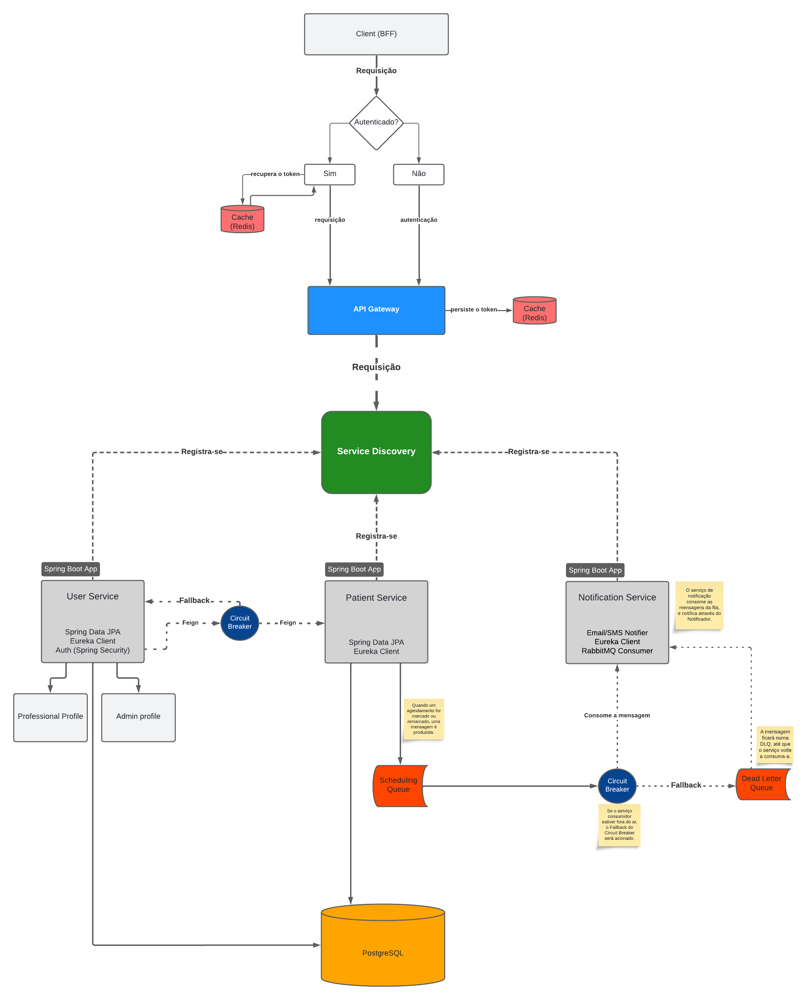

# Sistema de Microsserviços com Java/Spring Boot e NestJS

## Descrição

Este projeto implementa uma nova solução para as funcionalidades do sistema Psiboard baseada em microsserviços utilizando Java e Spring Boot dividido em microsserviços. A arquitetura segue o padrão hexagonal, promovendo uma separação clara de responsabilidades entre a lógica de domínio e as interações externas. O projeto também utiliza um API Gateway para gerenciamento de requisições e um serviço de descoberta (Service Discovery) para garantir que os microsserviços se encontrem e se comuniquem de forma eficiente. Também foi pensado e implementado um client BFF em NestJS para atuar como fonte de acesso aos serviços, fornecendo uma ponte otimizada para a interação com os microsserviços.

## Tecnologias Utilizadas

### Backend

- **Java 17**: Linguagem principal para os microsserviços.
- **Spring Boot 3.x**: Framework para facilitar o desenvolvimento de aplicações robustas e escaláveis.
- **Spring Cloud**: Utilizado para implementar padrões de microsserviços como:
  - **API Gateway**: Para rotear e controlar o tráfego entre clientes e microsserviços.
  - **Service Discovery (Eureka/Consul)**: Para permitir que os serviços registrem e descubram uns aos outros dinamicamente.
- **Arquitetura Hexagonal (Ports and Adapters)**: Organiza o código em torno de casos de uso, permitindo fácil adaptação a diferentes tecnologias externas.
- **NestJS**: Framework Node.js para construção do Client BFF.
  - O BFF atua como um intermediário entre os microsserviços e o cliente final, agregando e formatando dados conforme necessário.
- **Docker**: Para poder startar os serviços em containers orquestrados.
- **Redis**: Serviço de cache para armazenamento do token de acesso usado para liberar requisições à rotas

## Estrutura do Projeto

A arquitetura deste projeto segue o padrão de microsserviços, onde cada serviço é independente e responsável por uma funcionalidade específica dentro do sistema. Os principais componentes incluem:

1. **API Gateway**:

   - Gerencia o roteamento das requisições entre o cliente e os microsserviços.
   - Centraliza a autenticação e autorização.
   - Aplica políticas de segurança e controle de tráfego.

2. **Service Discovery**:

   - Facilita a comunicação entre microsserviços, permitindo que eles se registrem dinamicamente e descubram uns aos outros.
   - Garante escalabilidade e alta disponibilidade.

3. **Microsserviços**:

   - Cada microsserviço é autônomo, responsável por uma parte específica do domínio.
   - Implementados com Spring Boot, cada serviço segue a Arquitetura Hexagonal, separando a lógica de negócio dos detalhes técnicos (bancos de dados, APIs externas, etc.).

4. **Client BFF (Backend for Frontend)**:
   - Implementado com NestJS, o BFF faz a agregação de dados para o frontend.
   - Reduz a complexidade e latência no frontend, oferecendo respostas otimizadas e personalizadas para o cliente.

## Arquitetura do projeto

## Configurações do Projeto

O entrypoiont inicial do projeto é o BFF, porém os demais serviços precisam estar ativos para haver a comunicação. O projeto está configurado tanto para uso local (rodando os apps Spring separadamente), quanto para uso containerizado no Docker (rodando o docker-compose.yaml)
   - **Detalhe:** É preciso ter posse de arquivo de configuração (.env), para conexão com a base de dados.